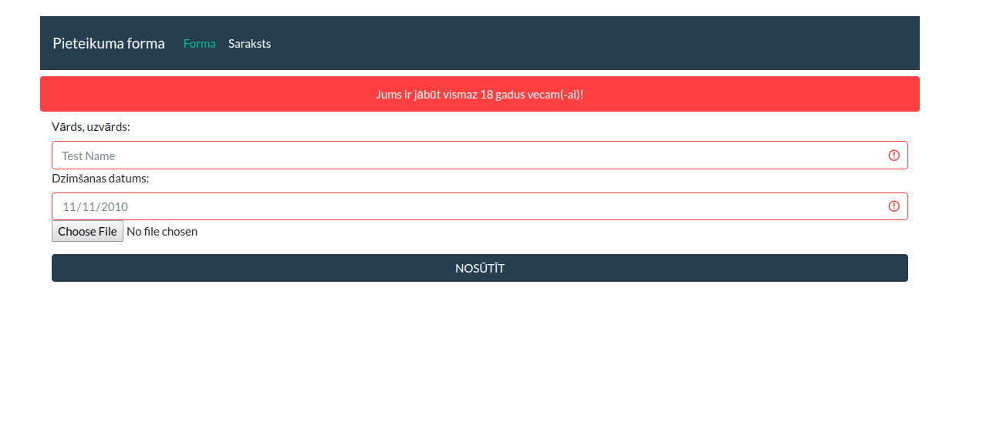
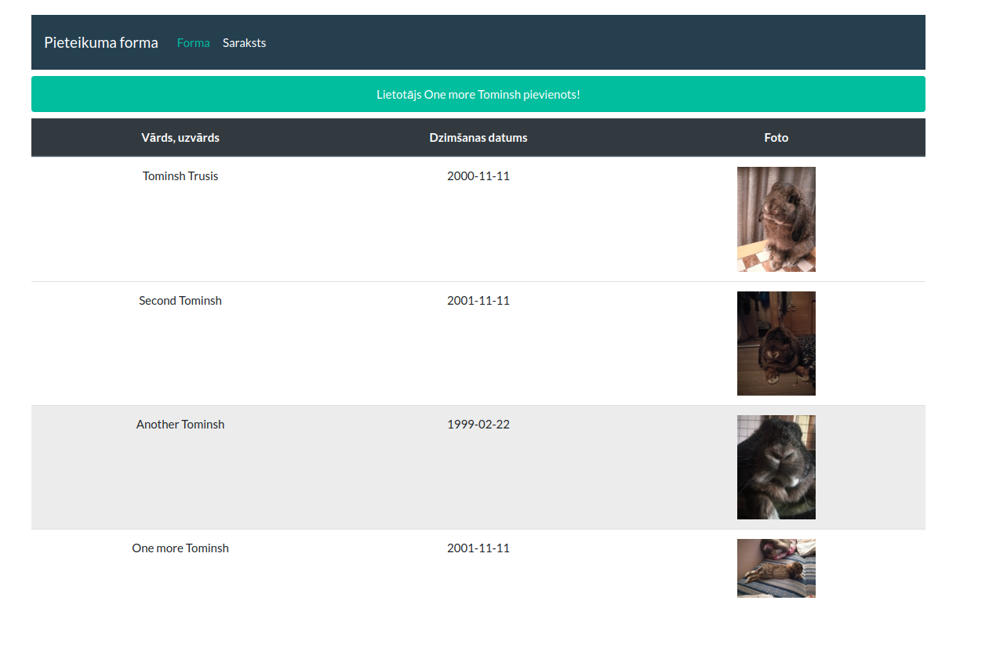

# Application form

##### Before running the application make "photos" folder in main program directory.

##### Form data is validated:

- Name field must have at least two words (name, surname), latin alphabet only + "-"
- Age restriction - registrant should be at least 18 year`s old  
- Image file should be with "PNG" or "JPG" extension 

##### Data is stored in "users.json" file

##### Bootstrap/Bootswatch used, sessions for alert messages. 

Screenshots:

